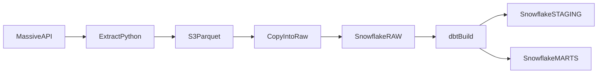

# US Equity Daily Bars

Batch ELT pipeline for unadjusted daily bars across the US stock market. One grouped request returns the session. Python archives that response as Parquet on Amazon S3. Snowflake holds the loaded copy, and dbt publishes a small star schema for analysis.

**Stack:** Python, Massive market data API, Amazon S3, Snowflake, dbt, Apache Airflow.

## Highlights

- One request per market date covers US listed stocks and lands as a single dated Parquet partition.
- Bronze keeps the vendor payload. Python drops no rows and renames no fields. Quality rules run in SQL, where they can be tested.
- Prices are stored unadjusted, so a later split cannot rewrite the archive.
- Re-running a date replaces that partition and reloads only that date.
- A closed session lands as a zero-row file, distinct from a day the job never ran.
- The daily run is the next morning, after the vendor's end-of-day aggregates have settled.

## Status

Portfolio project, built in phases.

**In the repository:** the extract. `python -m extract.daily_bars YYYY-MM-DD` lands one market date on S3.

**Specified, not built yet:** the Snowflake `COPY` into `RAW`, the dbt project, and the Airflow DAG. The warehouse and schedule sections are the design those pieces follow.

## Architecture



| Step | Responsibility |
| --- | --- |
| Extract | One Massive request, one Parquet partition per market date. |
| Bronze | S3 archive of the vendor response. |
| Load | Date-scoped `COPY` into `MARKET.RAW`. |
| Transform | dbt builds `STAGING` and `MARTS` in Snowflake. |
| Serve | Analysts query `MARKET.MARTS`. |

Airflow orders those steps. Extract, load, and the dbt models hold the business rules, and each can run without the scheduler.

## Landing

```text
GET https://api.massive.com/v2/aggs/grouped/locale/us/market/stocks/{date}
```

Query parameters are `adjusted=false` and `include_otc=false`. The key is sent as `Authorization: Bearer` from `MASSIVE_API_KEY`, with `Accept-Encoding: gzip`. OTC names are left out. The pipeline does not call the API once per ticker.

These nine columns are always present:

| Key | Meaning | Storage type |
| --- | --- | --- |
| `T` | Ticker | string |
| `o`, `h`, `l`, `c` | Open, high, low, close | float |
| `v` | Volume | float |
| `vw` | Volume-weighted average price | float |
| `t` | Bar window start, epoch milliseconds | int |
| `n` | Transaction count | int |

`otc`, and any other key on a result, is kept when the payload includes it. The file does not carry `trade_date`, `adjusted`, or `extracted_at`. The partition path and `manifest.json` hold that landing metadata.

```text
bronze/daily_bars/trade_date=YYYY-MM-DD/bars.parquet
bronze/daily_bars/trade_date=YYYY-MM-DD/manifest.json
```

`S3_PREFIX` overrides the `bronze/daily_bars` prefix. The manifest records the trade date, row count, `extracted_at`, the vendor request id and status, and the `adjusted` and `include_otc` parameters that were sent.

A closed day still lands an empty partition with the standard columns, so a weekend or holiday is different from a missing run. An empty response on a trading session fails without uploading. The finished object is written to its final key in one put. A failed request leaves the previous good object in place.

Python does not filter prices. A null ticker, a null close, a high below the low, or a negative volume is quarantined later in SQL. The S3 object remains the vendor payload.

## Warehouse

Three schemas in the `MARKET` database, each with one job:

- **`RAW.DAILY_BARS`** is the loaded copy of bronze. dbt does not build it. A reload is one transaction: delete that `trade_date`, `COPY INTO` the partition with `MATCH_BY_COLUMN_NAME`, and commit. A second run leaves one copy of the day.
- **`STAGING`** is silver. Models cast types, keep one row per ticker and trade date (latest `extracted_at` wins), and write passing rows to `stg_daily_bars`. Failing rows go to `stg_daily_bars_quarantine`.
- **`MARTS`** is gold, the only schema an analyst should query. `dbt build` rebuilds it from silver. Several years of daily bars are a small Snowflake workload, so the models stay full refreshes while they are still young.

Gold is a star schema from daily bars alone:

- **`dim_date`**: one row per calendar date in the loaded range, including weekends, from `dbt_utils.date_spine`. Weekends are flagged. A holiday is a weekday with no fact rows.
- **`dim_ticker`**: one row per symbol seen in the bars, with the first and last trade date. Name, exchange, and security type wait for a reference feed.
- **`fact_daily_bar`**: one row per ticker per trade date. Measures are unadjusted open, high, low, close, volume, VWAP, and transaction count.

The natural key is the ticker symbol plus the trade date. Close-to-close change on this fact is a price change. Splits and dividends are not in the extract, so the fact is not a total return.

Custom dbt schemas land in `STAGING` and `MARTS` directly. The project overrides `generate_schema_name` so dbt does not concatenate those names onto the target schema.

`dbt build` checks the fact for a unique `(ticker, trade_date)`, required keys, `high` greater than or equal to `low`, `volume` greater than or equal to zero, and a ticker that exists on `dim_ticker`. `RAW.DAILY_BARS` is a source with a freshness check on `extracted_at`. It warns after about 3 days, so a weekend between next-morning loads stays quiet.

Questions the marts are shaped to answer:

- Daily bars for one ticker over a month.
- Average volume by ticker across its most recent 20 bars.
- Symbols whose first observed trade date falls inside a chosen window.

S3 is the record of the vendor payload. `MARTS` is the record of the analyst definition. The pipeline writes objects with its own AWS credentials. Snowflake reads them through a storage integration and an external stage.

## Orchestration

The daily DAG runs at 06:00 America/New_York, Tuesday through Saturday (`0 6 * * 2-6`), and lands the previous day. Tuesday loads Monday. Saturday loads Friday. By then the vendor's end-of-day aggregates have settled. The after-hours session closes at 20:00.

`trade_date` is an explicit DAG parameter. It defaults to the run's New York date minus one day. The same parameter is how backfills and manual runs pass a date. Airflow's `logical_date` is left unused for this, because its meaning depends on the timetable. A holiday lands an empty partition. Retries cover a trading day the vendor has not published yet.

Task order: land the date on S3, reload that date into `RAW`, then `dbt build`.

A historical load walks dates in order and calls the same Python functions. Each date can be run again safely, so a stopped backfill continues from the date you choose. Dates run one at a time, which keeps vendor rate limits predictable.

Airflow runs locally in Docker, with the UI on port 8080. Snowflake auth for Airflow and dbt is key-pair. Secrets stay in the environment, and the dbt profile reads them with `env_var`. The warehouse is set to suspend when idle.

## Decisions

**Keep the vendor file.** Business rules run after the landing. Reloading the archive rebuilds a model, and it can still show exactly what the API returned.

**Store unadjusted prices.** Massive applies split adjustment unless the request sets `adjusted=false`. A later split would change values already written. Adjustment belongs in a later model, once split events are extracted.

**Quarantine bad rows.** Failing rows stay queryable in staging. The bronze file is the evidence.

**Land closed days.** An empty partition tells a downstream job that the market was closed.

**Rebuild silver and gold in full.** The SQL stays easy to read, and this grain will not outgrow a full refresh quickly.

**Keep the DAG thin.** Airflow handles the clock, retries, and backfill. dbt handles model order, tests, and lineage.

**Split the S3 identities.** The writer and the Snowflake storage integration are different IAM roles. That is the usual external-stage setup, and it keeps warehouse credentials separate from the keys that can overwrite the lake.

## Run the extract

Requires Python 3.14, a Massive API key, and an S3 bucket the local AWS credentials can write to. Copy `.env.example` to `.env` and set `MASSIVE_API_KEY` and `S3_BUCKET`. `S3_PREFIX` defaults to `bronze/daily_bars`. `AWS_REGION` is optional.

```text
python -m venv .venv
```

Windows:

```text
.venv\Scripts\python.exe -m pip install -r requirements.txt
.venv\Scripts\python.exe -m extract.daily_bars 2024-03-15
```

macOS or Linux:

```text
.venv/bin/python -m pip install -r requirements.txt
.venv/bin/python -m extract.daily_bars 2024-03-15
```

A regular session lands thousands of symbols. A Saturday lands zero rows and a manifest with `row_count` 0.

Runtime packages are pinned in `requirements.txt`. The `dev` group in `pyproject.toml` holds pytest, responses, moto, and Ruff for local checks. Install it with `python -m pip install --group dev` from the repository root.

## Repository

```text
extract/daily_bars.py      grouped daily request, Parquet write, S3 put
extract/config.py          environment
requirements.txt           runtime packages
pyproject.toml             dev group (pytest, responses, moto, Ruff), Ruff and pytest settings
.env.example               variable names, no secrets
```

Still to come, on the design above: `load/copy_daily_bars.py`, `snowflake/bootstrap.sql` (database `MARKET`, `RAW.DAILY_BARS`, the Parquet file format, and the storage integration and stage), a dbt project under `transform/`, and `dags/daily_market_bars.py` with Docker Compose for local Airflow. dbt creates `STAGING` and `MARTS`.

## Out of scope

Reference data, splits, dividends, adjusted and total-return series, minute bars, trades, quotes, websockets, OTC names, a separate processing cluster, incremental models, hosted Airflow, and deployment automation. Those are later datasets and operations. This repository is the daily path.
